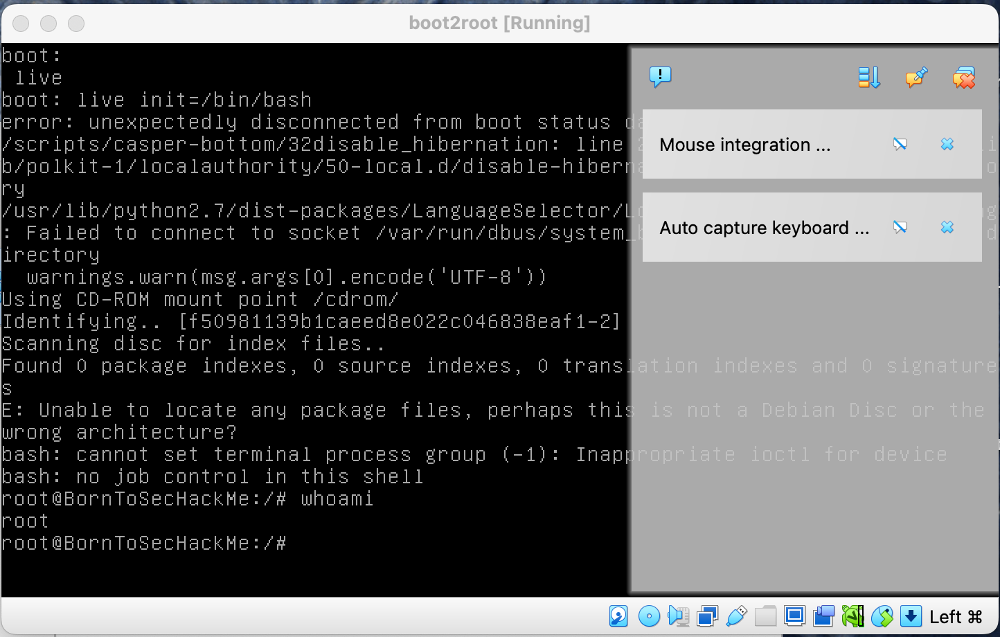

## Reboot machine

At the start of the VM, if we press `shift` many times the **Grub** menu will appear. 
Then, we can select whatever partition we want and change the default **init** script by `/bin/bash`:
